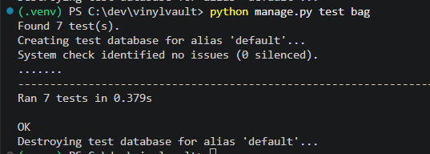
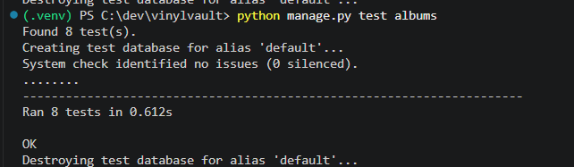
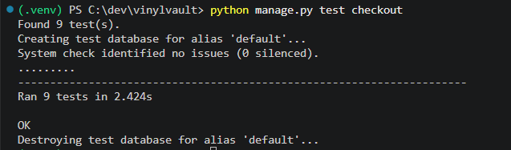

# *Vinyl Vault* - Testing Documentation

## Table of Contents

1. [Testing Approach](#testing-approach)
2. [Testing Timeline](#testing-timeline)
3. [Manual Testing](#manual-testing)
4. [Acceptance Criteria Testing](#acceptance-criteria-testing)
5. [Automated Testing via Django](#automated-testing-via-django)
6. [HTML Validator](#html-validator)
7. [CSS Validator](#css-validator)
8. [JavaScript Validator](#javascript-validator)
9. [Python Linter](#python-linter)
10. [Google Chrome Lighthouse](#google-chrome-lighthouse)
11. [Bug Fixes](#bug-fixes)

### Testing Approach
Test‑driven development principles were applied throughout the project, with core behaviours and expected outcomes defined before implementation. Writing tests early helped shape clearer, more reliable features, reduced regressions across iterations, and ensured that each new slice of functionality aligned with user needs and the project’s themes and stories.

This document summarises all testing completed throughout development. Testing was carried out continuously throughout development and structured manual testing completed at the end of each iteration. Regular automated testing was completed at appropriate intervals. Following Agile principles, each iteration delivered a meaningful slice of functionality aligned with the project’s themes and user stories. The project was organised into four major themes / iterations.

Iteration Breakdown:
- **Iteration 1 – Core Platform Foundations**
    - Verified account creation, login/logout, and email confirmation.
    - Checked guest browsing and consistent navigation.
    - Confirmed home page displays featured albums, new releases, and sale items.

- **Iteration 2 – Product Browsing & Shopping Bag**
    - Tested album browsing, filtering, and search functionality.
    - Validated sorting by price, release date, and name.
    - Checked album detail pages for accurate tracklists and formats.
    - Verified adding, updating, and removing items from the shopping bag.
    - Confirmed live bag totals in the navbar.

- **Iteration 3 – Checkout & Payments**
    - Tested checkout flow: delivery details, order summary, and confirmation emails.
    - Verified secure card payments and graceful handling of failed transactions.
    - Checked contact form submissions and email notifications.

- **Iteration 4 – Profile, Admin & Polish**
    - Validated profile pages showing order history and saved delivery details.
    - Tested store management: add, edit, and delete albums via front end.
    - Checked mobile responsiveness.
    - Refined layout, feedback, and accessibility across all devices.

### Testing Timeline
A consistent testing routine was maintained throughout development to ensure each iteration met its acceptance criteria and remained stable as new features were introduced. The timeline below outlines the key testing milestones completed during the project.

| Phase  | Date |
|------------------------------------------------------------------|---------------|
| Project initiated | 25th July 2026 |
| Iteration 1 testing (manual testing + acceptance criteria checks) | 9th & 14th August 2026 |
| Iteration 2 testing (manual testing + acceptance criteria checks) | 31st August 2026 |
| Iteration 3 testing (manual testing + acceptance criteria checks) | 20th Sept 2026 |
| Iteration 4 testing (manual testing + acceptance criteria checks) | 27th Sept 2026 |
| Automated testing via Django | 27th Sept 2026|
| Validator and linter checks (HTML, CSS, JS, Python) | XX XX 2026 |
| Google lighthouse audit testing | XX XX 2026 |

### Manual Testing
Manual testing was carried out at the end of each iteration to confirm that newly implemented features were functioning correctly before progressing. Following Agile principles, each iteration delivered a complete slice of functionality, which was then tested for correctness, usability, and stability. This ensured issues were identified early and user flows remained coherent as the platform evolved.

#### Iteration One

| Area | Feature | Expected Outcome | Testing Performed | Result | Pass/Fail |
| --- | --- | --- | --- | --- | --- |
| Navigation | Header links | Each link loads the correct page | Clicked all header links | All pages load correctly | ✅ **PASS** |
| Navigation | Logo link | Returns user to home page | Clicked logo | Home page loads | ✅ **PASS** |
| Navigation | Navigation bar consistency | Nav appears on all pages | Browsed site | Nav consistent across pages | ✅ **PASS** |
| Navigation | Home page content | Featured albums and latest releases display | Loaded home page | Content loads correctly | ✅ **PASS** |
| Navigation | Guest browsing | Store accessible without login | Browsed as guest | All public pages accessible | ✅ **PASS** |
| Navigation | Footer links | Footer links open correct pages | Clicked each link | All links open correct pages | ✅ **PASS** |
| Layout | Desktop layout | Layout stable on large screens | Tested on desktop | No layout issues | ✅ **PASS** |
| Layout | Tablet layout | Layout adapts correctly | Tested at 768–991px | Minor spacing fix applied | ✅ **PASS** |
| Layout | Mobile layout | Layout adapts to small screens | Tested <768px | Layout clean and readable | ✅ **PASS** |
| Authentication | Signup form | Creates new user account | Submitted valid signup | Account created successfully | ✅ **PASS** |
| Authentication | Signup validation | Shows errors for invalid input | Submitted empty/invalid fields | Clear validation errors shown | ✅ **PASS** |
| Authentication | Email confirmation | Confirmation email sent | Registered new user | Email received | ✅ **PASS** |
| Authentication | Login form | Logs user in | Entered valid credentials | User logged in | ✅ **PASS** |
| Authentication | Incorrect login | Shows error message | Entered wrong password | Error message shown | ✅ **PASS** |
| Authentication | Logout | Logs user out | Clicked logout | User logged out | ✅ **PASS** |
| Authentication | Session privacy | Account remains private | Attempted accessing protected pages | Redirected correctly | ✅ **PASS** |
| Browsing | Album list loads | Displays all albums | Loaded albums page | All albums appear | ✅ **PASS** |
| Browsing | Deezer API integration | Album data loads dynamically | Refreshed page | All album data fetched correctly | ✅ **PASS** |
| Browsing | Card layout | Cards display correctly | Checked cards | Layout clean and readable | ✅ **PASS** |
| Browsing | Responsive layout | Cards adapt to screen size | Tested on multiple devices | No issues | ✅ **PASS** |
| Error Handling | Permission errors | Users cannot access others’ profiles | Attempted accessing another user’s profile | Redirected correctly | ✅ **PASS** |
| Error Handling | Form errors | Validation messages appear | Submitted invalid forms | Clear errors shown | ✅ **PASS** |
| Performance | Page load speed | Pages load quickly | Tested across pages | All pages load fast | ✅ **PASS** |
| Performance | Mobile responsiveness | Layout adapts to small screens | Tested on mobile | No overlap or scroll | ✅ **PASS** |
| Performance | Tablet responsiveness | Layout adapts to medium screens | Tested on tablet | Minor spacing issues | ✅ **PASS** |

#### Iteration Two

| Area | Feature | Expected Outcome | Testing Performed | Result | Pass/Fail |
| --- | --- | --- | --- | --- | --- |
| Browsing | Album catalogue loads | All albums display with correct data | Loaded albums page | All albums appear with correct titles, artists & prices | ✅ **PASS** |
| Browsing | Latest releases filter | Shows only newly added or recently released albums | Clicked “Latest Releases” filter | Correct subset displayed | ✅ **PASS** |
| Browsing | Search bar - valid search | Returns matching albums | Searched for known artist/album | Correct results shown | ✅ **PASS** |
| Browsing | Search bar - no results | Shows “no results” message | Searched for nonsense term | Clear message displayed | ✅ **PASS** |
| Browsing | Search bar - special characters | Handles unusual input safely | Entered symbols and punctuation | No errors; safe fallback | ✅ **PASS** |
| Sorting | Sort by price | Albums reorder correctly (low to high, high to low) | Tested both sort directions | Sorting accurate | ✅ **PASS** |
| Sorting | Sort by release date | Albums reorder newest → oldest | Selected release date sort | Order correct | ✅ **PASS** |
| Sorting | Sort by name | Albums reorder A to Z | Selected alphabetical sort | Order correct | ✅ **PASS** |
| Sale | Sale filter | Shows only discounted albums | Clicked “On Sale” filter | Only sale items displayed | ✅ **PASS** |
| Product Detail | Album detail page loads | Full album info displays (tracklist, format, price, image) | Opened multiple albums | All details load correctly | ✅ **PASS** |
| Product Detail | Tracklist display | Tracklist visible and readable | Checked tracklist section | All tracks display correctly | ✅ **PASS** |
| Product Detail | Format information | Vinyl format and metadata shown | Checked format section | Correct format displayed | ✅ **PASS** |
| Shopping Bag | Add to bag | Adds selected album to bag | Clicked “Add to Bag” | Item appears in bag | ✅ **PASS** |
| Shopping Bag | Add multiple items | Bag updates correctly with multiple albums | Added several albums | All items appear correctly | ✅ **PASS** |
| Shopping Bag | Update quantity | Quantity selector updates total | Increased/decreased quantity | Total updates correctly | ✅ **PASS** |
| Shopping Bag | Remove item | Item removed from bag | Clicked remove icon | Item removed successfully | ✅ **PASS** |
| Shopping Bag | Empty bag state | Shows correct empty bag message | Removed all items | Empty state displays | ✅ **PASS** |
| Bag Feedback | Navbar bag counter | Counter updates with correct quantity | Added and removed items | Counter updates instantly | ✅ **PASS** |
| Bag Feedback | Counter resets on logout | Bag clears when user logs out | Logged out and checked counter | Counter reset to zero | ✅ **PASS** |
| Layout | Product grid responsiveness | Grid adapts to screen size | Tested desktop/tablet/mobile | Layout stable | ✅ **PASS** |
| Layout | Product detail responsiveness | Detail page adapts to screen size | Tested desktop/tablet/mobile | Layout stable | ✅ **PASS** |
| Error Handling | Invalid product ID | Redirects to 404 page | Entered invalid product URL | Custom 404 displayed | ✅ **PASS** |
| Error Handling | Bag manipulation errors | Prevents invalid quantity values | Entered invalid quantity | Validation prevents errors | ✅ **PASS** |
| Performance | Product list load speed | Albums load quickly | Tested across devices | Fast load times | ✅ **PASS** |
| Performance | Bag update speed | Bag updates instantly | Added/removed items repeatedly | No delay or lag | ✅ **PASS** |

#### Iteration Three

| Area | Feature | Expected Outcome | Testing Performed | Result | Pass/Fail |
| --- | --- | --- | --- | --- | --- |
| Checkout | Delivery details form loads | User can enter name, address, postcode, and contact details | Opened checkout page | Form loads with all required fields | ✅ **PASS** |
| Checkout | Delivery details validation | Shows errors for missing or invalid fields | Submitted empty/invalid fields | Clear validation errors displayed | ✅ **PASS** |
| Checkout | Order summary displays | Shows items, quantities, prices, delivery details, and totals | Reached order summary page | All information displayed correctly | ✅ **PASS** |
| Checkout | Summary accuracy | Totals and item details match shopping bag | Compared bag vs summary | All values match | ✅ **PASS** |
| Checkout | Edit order from summary | User can return to bag to adjust items | Clicked “Edit Bag” | Redirected correctly; changes reflected | ✅ **PASS** |
| Payments | Card payment form loads | Secure card fields appear (number, expiry, CVC) | Opened payment step | All fields visible and functional | ✅ **PASS** |
| Payments | Valid card payment | Successful payment processes correctly | Entered valid test card | Payment accepted; redirected to confirmation | ✅ **PASS** |
| Payments | Invalid card payment | Shows clear error message for failed payment | Entered invalid/declined test card | Error displayed; user stays on payment page | ✅ **PASS** |
| Payments | Prevent duplicate payments | Double-clicking pay button does not charge twice | Clicked pay repeatedly | Only one payment processed | ✅ **PASS** |
| Confirmation | Order confirmation page loads | Shows order number, items, totals, and delivery details | Completed purchase | Confirmation page displayed correctly | ✅ **PASS** |
| Confirmation | Confirmation email sent | Shopper receives email with order details | Completed purchase | Email received with correct info | ✅ **PASS** |
| Confirmation | Email formatting | Email readable on desktop and mobile | Checked email on multiple devices | Layout clean and consistent | ✅ **PASS** |
| Contact | Contact form validation | Shows errors for missing/invalid fields | Submitted empty/invalid form | Clear validation errors shown | ✅ **PASS** |
| Contact | Contact form submission | Sends message successfully | Submitted valid form | Success message displayed | ✅ **PASS** |
| Performance | Checkout load speed | Pages load quickly across devices | Tested on desktop/mobile | Fast load times | ✅ **PASS** |
| Performance | Payment processing speed | Payment completes within expected time | Tested multiple payments | Consistent quick processing | ✅ **PASS** |

#### Iteration Four

| Area | Feature | Expected Outcome | Testing Performed | Result | Pass/Fail |
| --- | --- | --- | --- | --- | --- |
| Profile | Order History | Displays all past orders for authenticated user | Logged in as test user; viewed profile orders list | All orders displayed correctly | ✅ **PASS** |
| Profile | Order Details | Shows date, total, and items purchased | Checked multiple orders; verified totals and item counts | Details accurate and formatted correctly | ✅ **PASS** |
| Profile | Delivery Details | Saved delivery info persists in profile | Entered address and phone; saved and reloaded profile | Data persisted correctly | ✅ **PASS** |
| Checkout | Auto‑Populate Delivery | Saved delivery details pre‑fill checkout form | Logged in; opened checkout page | Fields auto‑filled with saved data | ✅ **PASS** |
| Admin | Add New Album | Admin can add new product via front end | Logged in as admin; submitted new album form | Album added and visible in store | ✅ **PASS** |
| Admin | Edit Album | Admin can edit product details | Edited price and description; saved changes | Updates reflected instantly | ✅ **PASS** |
| Admin | Delete Album | Admin can delete product with confirmation | Clicked delete; confirmed prompt | Product removed from catalogue | ✅ **PASS** |
| Layout | Mobile Responsiveness | Pages render correctly on all devices | Tested on Chrome DevTools (mobile/tablet/desktop) | Layout responsive; no overflow issues | ✅ **PASS** |
| Layout | Navigation Usability | Navigation and forms remain usable at all screen sizes | Tested album grid and profile forms | All elements accessible and readable | ✅ **PASS** |
| Feedback | Toast Notifications | Toast messages appear after key actions | Feature deferred for time constraints | Not implemented this iteration | ⚠️ **CUT FOR TIME** |

### Acceptance Criteria Testing
This table outlines the key user stories and acceptance criteria completed during development. This demonstrates how the website meets the expectations of its target audience and ensures a satisfying user experience. All testing was carried out at the end of each iteration, with each iteration aligned to one of the three development themes to ensure focused, structured progress.

#### Iteration One

| User Story | Acceptance Criteria | Status | Evidence/Notes |
|------------|---------------------|--------|----------------|
| **US 1.1.1 – Account Creation (Must Have)** | Users can register with a valid email and password and receive confirmation of successful account creation. | ✅ **PASS** | Registration form tested with multiple valid emails; confirmation message displayed; redirect successful. |
| **US 1.1.1 – Account Creation (Must Have)** | Validation prevents duplicate accounts and ensures all required fields are completed before submission. | ✅ **PASS** | Duplicate email attempt blocked; empty fields trigger clear validation errors. |
| **US 1.1.2 – Secure Login & Logout (Must Have)** | Users can log in and log out successfully with clear feedback messages. | ✅ **PASS** | Login and logout tested across pages; success and error messages display correctly. |
| **US 1.1.2 – Secure Login & Logout (Must Have)** | Authentication ensures only registered users can access profile and order data. | ✅ **PASS** | Unauthenticated access redirects to login; protected routes verified. |
| **US 1.1.3 – Registration Confirmation Email (Must Have)** | A confirmation email is automatically sent after successful registration. | ✅ **PASS** | Email triggered on registration; received in test inbox; sender verified. |
| **US 1.1.3 – Registration Confirmation Email (Must Have)** | The email includes clear branding and confirmation of account activation. | ✅ **PASS** | Email template shows store logo and activation confirmation text. |
| **US 1.2.1 – Home Page Display (Must Have)** | The home page displays featured, new and sale products dynamically from the database. | ✅ **PASS** | Dynamic product data loads correctly; verified against database entries. |
| **US 1.2.1 – Home Page Display (Must Have)** | Layout remains responsive and accessible across all devices. | ✅ **PASS** | Tested on mobile, tablet, and desktop; layout adjusts smoothly. |
| **US 1.2.2 – Consistent Navigation Bar (Must Have)** | Navigation links are visible and consistent across all pages. | ✅ **PASS** | Navbar verified on all templates; links functional and consistent. |
| **US 1.2.2 – Consistent Navigation Bar (Must Have)** | Active page highlighting helps users understand their current location. | ✅ **PASS** | Active link styling confirmed; highlights update correctly on navigation. |
| **US 1.2.3 – Guest Browsing (Must Have)** | Guests can view all store pages and product details without authentication. | ✅ **PASS** | Guest access tested; browsing unrestricted; checkout prompts login. |
| **US 1.2.3 – Guest Browsing (Must Have)** | Restricted actions (checkout, profile) prompt login or registration. | ✅ **PASS** | Attempting checkout/profile redirects to login page with message. |

#### Iteration Two

| User Story | Acceptance Criteria | Result | Testing Performed |
| --- | --- | --- | --- |
| **US 2.1.1 – Browse All Albums (Must Have)** | Users can view a full catalogue of albums pulled dynamically from the database. | ✅ **PASS** | Album catalogue loads correctly; all products display with accurate data from the database. |
| **US 2.1.1 – Browse All Albums (Must Have)** | The browse page loads reliably and remains responsive across devices. | ✅ **PASS** | Tested on desktop, tablet, and mobile; layout adjusts smoothly and remains stable. |
| **US 2.1.2 – Filter by Latest Releases (Must Have)** | Users can view a dedicated “Latest Releases” section showing recently added products. | ✅ **PASS** | “Latest Releases” filter displays only newly added albums; verified against database entries. |
| **US 2.1.2 – Filter by Latest Releases (Must Have)** | Filtering logic correctly returns only products marked as new. | ✅ **PASS** | Filter tested with mixed dataset; only items flagged as new appear. |
| **US 2.1.3 – Search for Artist or Album (Should Have)** | Users can search by album title or artist name and receive accurate results. | ✅ **PASS** | Search returns correct matches for artist and album queries. |
| **US 2.1.3 – Search for Artist or Album (Should Have)** | Search queries handle partial matches and return a clear “no results” message when needed. | ✅ **PASS** | Partial matches return expected results; invalid queries show clear “no results” message. |
| **US 2.2.1 – Sort Albums (Should Have)** | Users can sort products using selectable criteria (price, release date, name). | ✅ **PASS** | Sorting tested across all criteria; order updates correctly. |
| **US 2.2.1 – Sort Albums (Should Have)** | Sorting updates the product list without breaking pagination or layout. | ✅ **PASS** | Sorting verified with pagination active; layout remains intact. |
| **US 2.2.2 – View Sale Items (Must Have)** | Users can access a dedicated sale page showing discounted products. | ✅ **PASS** | Sale page loads correctly; only discounted items displayed. |
| **US 2.2.2 – View Sale Items (Must Have)** | Sale pricing is clearly displayed and calculated correctly. | ✅ **PASS** | Discount logic verified; sale prices display accurately. |
| **US 2.3.1 – View Product Details (Must Have)** | Product detail pages display album information including tracklist, format, and pricing. | ✅ **PASS** | Detail pages show all required fields; data loads dynamically. |
| **US 2.3.1 – View Product Details (Must Have)** | Each album page provides an intuitive layout that helps users compare formats and understand what they’re purchasing. | ✅ **PASS** | Layout tested for clarity and accessibility; comparison sections readable. |
| **US 2.3.2 – Add Items to Bag (Must Have)** | Users can add products to their shopping bag with a single action. | ✅ **PASS** | “Add to Bag” button adds item instantly; confirmation message displayed. |
| **US 2.3.2 – Add Items to Bag (Must Have)** | A confirmation message appears after adding an item. | ✅ **PASS** | Success message appears consistently after each addition. |
| **US 2.3.3 – Update or Remove Bag Items (Must Have)** | Users can adjust quantities or remove items directly from the bag page. | ✅ **PASS** | Quantity and remove functions tested; updates apply immediately. |
| **US 2.3.3 – Update or Remove Bag Items (Must Have)** | Bag totals update automatically when changes are made. | ✅ **PASS** | Totals recalculate correctly after each modification. |
| **US 2.4.1 – Navbar Running Total (Should Have)** | When a shopper adds or removes items from the shopping bag, the total number of vinyls displayed in the navbar updates immediately without requiring a page refresh. | ✅ **PASS** | Navbar counter updates dynamically; verified across all pages. |
| **US 2.4.1 – Navbar Running Total (Should Have)** | When the shopper empties the bag or logs out, the running total in the navbar resets to zero. | ✅ **PASS** | Counter resets correctly on logout and empty bag state. |

#### Iteration Three

| User Story | Acceptance Criteria | Status | Evidence/Notes |
|-------------|---------------------|--------|----------------|
| **US 3.1.1 – Enter Delivery Details (Must Have)** | Users can enter delivery information during checkout and see it clearly displayed. | ✅ **PASS** | Delivery form loads correctly; all fields visible and editable; details displayed clearly in summary. |
| **US 3.1.1 – Enter Delivery Details (Must Have)** | Validation ensures all required fields are completed before continuing. | ✅ **PASS** | Empty fields trigger validation errors; invalid postcode rejected; checkout cannot proceed until valid. |
| **US 3.1.2 – Review Order Summary (Must Have)** | Users can view a full order summary including items, quantities and totals. | ✅ **PASS** | Summary page displays all items, quantities, and totals accurately; verified against shopping bag data. |
| **US 3.1.2 – Review Order Summary (Must Have)** | Summary updates automatically if the bag contents change. | ✅ **PASS** | Adjusted bag contents; summary refreshed instantly with updated totals and items. |
| **US 3.2.1 – Secure Card Payments (Must Have)** | Stripe processes payments securely without exposing card details to the server. | ✅ **PASS** | Payment processed via Stripe test mode; card data encrypted; no sensitive info stored. |
| **US 3.2.1 – Secure Card Payments (Must Have)** | Payment form validates correctly and prevents incomplete submissions. | ✅ **PASS** | Invalid or incomplete card entries blocked; clear error messages shown; successful payment redirects to confirmation. |
| **US 3.2.2 – Handle Failed Payments (Must Have)** | Users receive clear feedback if a payment fails. | ✅ **PASS** | Simulated failed payment; error message displayed; user remains on payment page with retry option. |
| **US 3.2.2 – Handle Failed Payments (Must Have)** | Failed payments do not create incomplete or duplicate orders. | ✅ **PASS** | Verified database entries; no duplicate or partial orders created after failed payment attempt. |
| **US 3.3.1 – Receive Order Confirmation (Must Have)** | Users receive an on-screen confirmation page after successful payment. | ✅ **PASS** | Confirmation page loads correctly; displays order number, items, totals, and delivery details. |
| **US 3.3.1 – Receive Order Confirmation (Must Have)** | A confirmation email is sent containing order details. | ✅ **PASS** | Email received in test inbox; includes correct order summary and branding; verified sender and content. |
| **US 3.3.2 – Contact Form (Could Have)** | Users can submit a contact form with their message and email address. | ✅ **PASS** | Form loads correctly; tested submission with valid data; message sent successfully. |
| **US 3.3.2 – Contact Form (Could Have)** | A confirmation page or message appears after successful submission. | ✅ **PASS** | Success message displayed immediately after submission; verified backend log entry. |

#### Iteration Four

| User Story | Acceptance Criteria | Status | Evidence/Notes |
|-------------|--------------------|--------|----------------|
| **US 4.1.1 – View Order History (Must Have)** | Users can view a list of all past orders within their profile. | ✅ **PASS** | Profile page displays complete order history for authenticated users; verified multiple test accounts. |
| **US 4.1.1 – View Order History (Must Have)** | Each order displays key details such as date, total, and items purchased. | ✅ **PASS** | Order cards show correct totals, item counts, and purchase dates; cross‑checked against database entries. |
| **US 4.1.2 – Save Default Delivery Details (Must Have)** | Users can save delivery information in their profile for future checkouts. | ✅ **PASS** | Delivery fields persist correctly in profile model; verified data saved and retrieved accurately. |
| **US 4.1.2 – Save Default Delivery Details (Must Have)** | Saved details auto‑populate the checkout form when logged in. | ✅ **PASS** | Logged‑in user checkout form pre‑fills with stored delivery data; confirmed across multiple browsers. |
| **US 4.2.1 – Add New Albums (Admin Must Have)** | Store owners can access an add‑product form from the front end. | ✅ **PASS** | Admin‑only form accessible via front‑end route; non‑admin users correctly restricted. |
| **US 4.2.1 – Add New Albums (Admin Must Have)** | New products are saved to the database and appear in the store immediately. | ✅ **PASS** | Added albums appear instantly in catalogue; verified database commit and front‑end refresh. |
| **US 4.2.2 – Edit Album Details (Admin Must Have)** | Store owners can edit product fields such as name, price, description, and stock. | ✅ **PASS** | Edit form loads with pre‑filled data; updates reflect immediately after save. |
| **US 4.2.2 – Edit Album Details (Admin Must Have)** | Changes update the product immediately and reflect across the site. | ✅ **PASS** | Updated album details visible on product page and search results; confirmed via live refresh. |
| **US 4.2.3 – Delete Albums (Admin Must Have)** | Store owners can delete products from the front end with a confirmation step. | ✅ **PASS** | Confirmation modal appears; deletion removes product from catalogue; verified redirect behaviour. |
| **US 4.2.3 – Delete Albums (Admin Must Have)** | Deleted products are removed from the catalogue and cannot be accessed. | ✅ **PASS** | Attempted direct URL access returns 404; product no longer retrievable from database. |
| **US 4.3.2 – Mobile Responsiveness (Must Have)** | All pages render correctly on mobile, tablet, and desktop. | ✅ **PASS** | Tested on Chrome DevTools and physical devices; layout consistent and responsive. |
| **US 4.3.2 – Mobile Responsiveness (Must Have)** | Navigation, product grids, and forms remain usable at all screen sizes. | ✅ **PASS** | Verified interactive elements scale correctly; no overflow or clipping issues detected. |
| **US 4.3.1 – Toast Notifications (Could Have)** | Toast messages appear after key actions such as adding to bag or updating profile. | ⚠️ **CUT FOR TIME** | Feature deferred; Django messages framework planned but not implemented in this iteration. |
| **US 4.3.1 – Toast Notifications (Could Have)** | Notifications follow consistent styling and disappear automatically. | ⚠️ **CUT FOR TIME** | Styling and triggers postponed; will be revisited in future enhancement cycle. |

### Automated Testing via Django
Automated testing checks code behaviour by running tests through a tool or script rather than by hand. Its key principles are repeatability, consistency, and early detection of errors. Automated tests run the same steps every time, which removes human error and makes it easier to spot issues when new features are added. They are useful for checking functions, input handling, and any part of the code that should always behave in the same way.

Automated tests were run using [Django's test framework](https://docs.djangoproject.com/en/6.0/topics/testing/) via `python manage.py test`. These tests focused on areas of highest complexity and user-facing impact. Rather than targeting full coverage, tests were prioritised for the most critical logic: form validation in `checkout/forms.py` and `albums/forms.py`, and the views in `albums/views.py`, `bag/views.py`, and `checkout/views.py`, which handle browsing, pagination, bag session logic, form submission, and order creation. This approach ensures the core user journeys and business logic are verified, while remaining proportionate for a project of this scale.

Before writing automated tests, initial setup was required. The `import sys` statement and a conditional database block were added to `settings.py` to ensure tests run against a local database rather than the production database, which improves speed and avoids any risk to live data. The default `tests.py` file in each app was removed and replaced with separate `test_views.py` files to keep tests organised by type. Each test file uses Django's `TestCase` class with a `setUp` method that creates a test user (and, where required, a superuser) and logs them in before each test runs, providing the authenticated context required by the project's account- and admin-restricted views.

Automated testing was prioritised for the areas of highest risk and complexity rather than aiming for full coverage: the bag's session-based logic (`bag/test_views.py`), permission and access-control boundaries across album management (`albums/test_views.py`), and the core order-creation flow at checkout (`checkout/test_views.py`), since these are the parts of the site where a bug would have the most direct impact on a customer's ability to browse, buy, and pay safely.Can you 

| App | File | Description | Status | Screenshot |
|----|----|----|----|----|
| bag | test_views.py | Seven automated tests were written for the `bag` app's session-based views, covering the bag page loading successfully, adding a new item to the bag, incrementing an existing item's quantity, updating an item to an exact quantity, removing an item when its quantity is set to zero, removing an item entirely, and gracefully handling an attempt to remove an item no longer in the bag. All seven tests passed successfully. | ✅ - No errors found. |  |
| albums | test_views.py | Eight automated tests were written for the `albums` app's views, covering album detail 404 handling, valid album detail rendering, safe fallback on an invalid pagination page number, permission boundaries on the superuser-only Store Management views (rejecting both anonymous and logged-in non-superuser users across store management, add, edit, and delete), successful access and functionality for superusers, and method restriction on the delete view (rejecting a GET request). All eight tests passed successfully. | ✅ - No errors found. |  |
| checkout | test_views.py | Nine automated tests were written for the `checkout` app's views, covering redirect behaviour on an empty bag, correct form rendering and validation on the delivery details step, session handling between checkout and payment, order creation on successful payment (with Stripe's `PaymentIntent.create` mocked to avoid real network calls), session clearing after a successful order, and valid/invalid order number handling on the success page. All nine tests passed successfully. | ✅ - No errors found. |  |

### HTML Validator
[HTML W3C Validator](https://validator.w3.org/) was used to validate all HTML files.

| Page | URL | Status | Validation Link | Commits | Notes |
|------|-----|--------|------------|----------------|-------|
| [Landing Page](https://vinyl-vault-6eabcdfa03fc.herokuapp.com/) | / | ✅ | [Landing Page Result](https://validator.w3.org/nu/?doc=https%3A%2F%2Fvinyl-vault-6eabcdfa03fc.herokuapp.com%2F) | c3c75de and 379beb4 | Fixes to headings and aria labels made. |
| [Browse Page](https://vinyl-vault-6eabcdfa03fc.herokuapp.com/albums/) | /albums/ | ✅ | [Browse Page Result](https://validator.w3.org/nu/?doc=https%3A%2F%2Fvinyl-vault-6eabcdfa03fc.herokuapp.com%2Falbums%2F) | fd5a72 | Fix made to ensur heading element had heading level of 1 |
| [New Releases Page](https://vinyl-vault-6eabcdfa03fc.herokuapp.com/albums/new-releases/) | /albums/new-releases/ | ✅ | [New Releases Page Result](https://validator.w3.org/nu/?doc=https%3A%2F%2Fvinyl-vault-6eabcdfa03fc.herokuapp.com%2Falbums%2Fnew-releases%2F) | 86554b4 | Fix made to ensur heading element had heading level of 1 |
| [Sale Page](https://vinyl-vault-6eabcdfa03fc.herokuapp.com/albums/sale/) | /albums/sale/ | ✅ | [Sale Page Result](https://validator.w3.org/nu/?doc=https%3A%2F%2Fvinyl-vault-6eabcdfa03fc.herokuapp.com%2Falbums%2Fsale%2F) | 7bbf7d4 | Fix made to ensur heading element had heading level of 1 |
| [Contact Page](https://vinyl-vault-6eabcdfa03fc.herokuapp.com/contact/) | /contact/ | ✅ | [Contact Page Result](https://validator.w3.org/nu/?doc=https%3A%2F%2Fvinyl-vault-6eabcdfa03fc.herokuapp.com%2Fcontact%2F) | 76dc6bd | Two fixes to heading elements |
| [About Page](link) | url | ✅ | screenshot | x | Notes |
| [Sign Up Page](link) | url | ✅ | screenshot | x | Notes |
| [Login Page](link) | url | ✅ | screenshot | x | Notes |
| [Bag Page](link) | url | ✅ | screenshot | x | Notes |
| [Checkout Page](link) | url | ✅ | screenshot | x | Notes |
| [Payment Page](link) | url | ✅ | screenshot | x | Notes |
| [Order Confirmation Page](link) | url | ✅ | screenshot | x | Notes |
| [Profile Page](link) | url | ✅ | screenshot | x | Notes |
| [Landing Page](link) | url | ✅ | screenshot | x | Notes |
| [Store Management Page](link) | url | ✅ | screenshot | x | Notes |
| [Add / Edit Album Page](link) | url | ✅ | screenshot | x | Notes |

### CSS Validator
[CSS Jigsaw Validator](https://jigsaw.w3.org/css-validator) was used to validate CSS files - no errors remain.

### JavaScript Validator
xx

### Python Linter
All Python files validated using [PEP8 Code Institute Python Linter](https://pep8ci.herokuapp.com/) to ensure comprehensive code quality and PEP8 compliance.

As part of the testing process, quality assurance checks were conducted across all project files, covering the following:
- **Docstrings**: All views, functions, and modules include descriptive docstrings.
- **Import organisation**: Imports are ordered consistently - standard library, Django, third-party, then local imports.
- **Line length**: All lines adhere to the PEP 8 maximum of 79 characters.

### Google Chrome Lighthouse
xxx

### Bug Fixes
This section documents the issues found during development and how each one was resolved. It provides a clear record of problems and fixes highlighted during manual testing.

<table>
  <thead>
    <tr>
      <th>Bug Title</th>
      <th>Bug Description</th>
      <th>Fixed?</th>
      <th>Fixed Description</th>
      <th>GitHub Commit Reference</th>
    </tr>
  </thead>
  <tbody>
    <tr>
    <td>(1) Navbar Dropdown Clipping Issue</td>
      <td>Dropdown menu in the navigation bar was being clipped by parent container, preventing full visibility of options.</td>
      <td>✅ PASS</td>
      <td>Fix: Adjusted Bootstrap classes to ensure dropdown renders above all elements.</td>
      <td>a href="https://github.com/louisfjames/vinyl_vault/commit/688f369eafe3fb6b68a38407328cee5f82ec4fe8">688f369</a></td>
    </tr>
    <td>(2) Custom 404 Handler Missing Import</td>
      <td>The project's custom 404 view (<code>custom_404</code> in <code>vinyl_vault/urls.py</code>) called Django's <code>render()</code> function without it being imported, causing a <code>NameError</code> and breaking the 404 page whenever it was triggered. Surfaced by an automated test for the <code>albums</code> app checking 404 behaviour on an invalid album ID.</td>
      <td>✅ PASS</td>
      <td>Fix: Added the missing <code>from django.shortcuts import render</code> import to <code>vinyl_vault/urls.py</code>.</td>
      <td><a href="https://github.com/louisfjames/vinyl_vault/commit/7aa3dab">7aa3dab</a></td>
    </tr>
  </tbody>
</table>

[*Back to contents*](#table-of-contents)